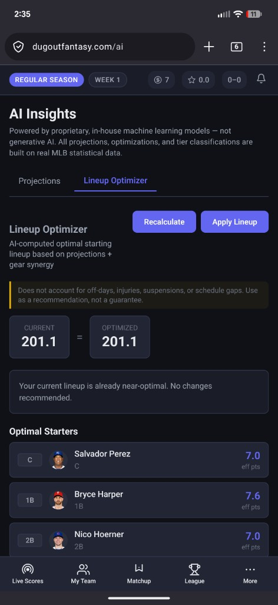

# Dugout — Fantasy Baseball RPG Platform

> Full-stack fantasy baseball with RPG equipment, a player-driven coin economy, and in-house ML on real MLB data. **Live production** app behind Docker, PostgreSQL, and Cloudflare (Tunnel + edge TLS).

**[Live app](https://dugoutfantasy.com)** · Private source · [Screenshots](#screenshots) · [Overview](#overview) · [Security](#security--production-hardening) · [Architecture](#architecture) · [ML pipeline](#ml-pipeline) · [System design](#system-design-highlights) · [Economy](#economy--balance-engineering) · [Ops](#operations) · [Testing](#testing)

---

## Screenshots

| Landing | In-app guide (“How to Play”) |
|---------|------------------------------|
|  |  |

| Equipment (8 slots + soulbound) | Weekly matchup & scoring breakdown |
|----------------------------------|-----------------------------------|
|  |  |

| Shop & marketplace | Gear locker |
|--------------------|-------------|
|  |  |

| MLB research (schedules + roster context) | AI insights & lineup optimizer |
|-------------------------------------------|--------------------------------|
|  |  |

---

## Overview

Dugout layers **RPG progression** on head-to-head fantasy baseball:

- **8 equipment slots** per player (hat, shades, chain, jersey, glove, bat, wristband, cleats) with **6 rarity tiers** (Common → Mythic).
- **Soulbound loot** from in-game performance; **marketplace** resales with tax sinks.
- **Auction draft** with **AI-assisted** nominations and bids; **solo leagues** with bot opponents and **multiplayer** leagues under one account.
- **5 bot personality archetypes** (Stars & Scrubs, Balanced, Value Hunter, Position Scarcity, Late Surge) with distinct bidding aggression, nomination strategy, and draft-phase scaling — bots feel like real opponents, not coin flips.
- **Flexible league sizes** — commissioners can **fill empty slots with AI managers** in pre-season so you don't need 10 humans. Play with 3 friends and 7 bots, or any mix.
- **Switch Mode** moves between Solo and League contexts with **independent rosters, gear, scores, and matchups**.
- **Unified transactions** surface for waivers and trades; **bot** teams participate in waivers and evaluate trades on schedule.
- **Research** pulls MLB schedules and rosters with fantasy ownership context.
- **AI Insights** exposes **projection models** and a **lineup optimizer** (non-generative ML); in-product copy distinguishes proprietary models from LLM hype.

---

## Security & production hardening

Ship-ready controls added for a public URL and real users:

| Area | Approach |
|------|----------|
| **API reads** | Data routes (`/leagues/...`, `/schedule`, marketplace, leaderboard, etc.) require **`Authorization: Bearer`** by default. Optional `DUGOUT_ALLOW_PUBLIC_READS` for debugging only. |
| **SSE** | Live score / draft streams expect a **JWT** (e.g. `?token=`) unless `DUGOUT_ALLOW_PUBLIC_SSE` is explicitly enabled. |
| **Admin / maintenance** | High-impact routes (`roster sync`, **bot pitcher backfill**, bot jobs) require **`X-Admin-Key`** matching `DUGOUT_ADMIN_API_KEY`; missing key → **404** in production. |
| **Manual scoring** | Gated behind env (`DUGOUT_ALLOW_MANUAL_SCORING`) outside dev to avoid stat injection abuse. |
| **Secrets in Compose** | Production compose passes admin key and feature flags from `.env` into the app container (not only JWT/DB). |
| **Password reset** | Email-based 6-digit code flow via Resend; rate-limited (3 req/min for send, 5/min for reset); silent success on unknown emails to prevent enumeration. |
| **Social / PWA** | Open Graph + Twitter Card meta, compressed **`og-image`**, PNG favicons + manifest icons. |

---

## Architecture

```
┌──────────────────────────────────────────────────────────────┐
│              Cloudflare (TLS, Tunnel, optional cache)         │
└──────────────────┬───────────────────────────────────────────┘
                   │
┌──────────────────▼───────────────────────────────────────────┐
│  Docker Compose                                               │
│                                                               │
│  ┌─────────────────────────────────────────────────────────┐  │
│  │  app (Gunicorn + Uvicorn workers)                       │  │
│  │  ┌──────────┐  ┌───────────┐  ┌──────────────────────┐   │  │
│  │  │ FastAPI  │  │ React SPA │  │ APScheduler          │   │  │
│  │  │ REST API │  │ (Vite)    │  │ (jobs, scoring, ML)  │   │  │
│  │  └────┬─────┘  └───────────┘  └──────────┬───────────┘   │  │
│  │       │  ┌──────────────────┐  ┌─────────▼──────────┐   │  │
│  │       └─►│ SQLModel / PG    │  │ ML stack           │   │  │
│  │          └──────────────────┘  │ GBR, GMM, draft    │   │  │
│  │                                │ agent, optimizer   │   │  │
│  └────────────────────────────────┴──────────────────────┘   │
│  ┌─────────────────────────────────────────────────────────┐  │
│  │  PostgreSQL 16 (volume)                                  │  │
│  └─────────────────────────────────────────────────────────┘  │
└──────────────────────────────────────────────────────────────┘
```

| Layer | Stack |
|-------|-------|
| **Frontend** | React 19, TypeScript, Vite, Zustand |
| **Backend** | FastAPI, SQLModel, Pydantic v2, Uvicorn/Gunicorn |
| **Database** | PostgreSQL 16 |
| **ML** | scikit-learn (GBR, GMM), NumPy, pandas |
| **Real-time** | SSE (`sse-starlette`) — draft room & live scores |
| **Data** | MLB Stats API, supporting Python tooling |
| **Auth** | JWT + bcrypt, email verification + password reset (Resend) |
| **Infra** | Multi-stage Docker image, **cloud VPS** + Cloudflare Tunnel |

---

## ML pipeline

### 1. Player projections (GBR)

Per-game fantasy points via **gradient boosted regression** on rolling game-log features (separate hitter/pitcher feature sets), tier-aware floors, and scheduled retraining as new games land.

### 2. Tier classification (GMM)

**Gaussian mixture models** cluster hitters and pitchers into **Star / Starter / Platoon / Bench**; soft assignment and covariance structure vs. rigid k-means. Tiers feed **loot rarity** tuning.

### 3. Draft agent & lineup optimizer

- **Draft recommendations** combine projection value, positional scarcity, roster need, and budget — with natural-language reasoning for the UI.
- **Bot personality engine** assigns one of **5 archetypes** per bot at draft creation (deterministic by user ID). Each archetype defines tier multipliers, bid increment ranges, timing profiles, and a "drain nomination" probability — bots will sometimes nominate stars they don't need to force opponents to overspend.
- **Dynamic bidding**: highest-valuation bot bids first (not random), personality-aware increments, and "fight" behavior where bots near their ceiling occasionally push past it.
- **Lineup optimizer** assigns starters under eligibility and **roster lock** rules; respects gear modifiers in effective scoring.
- Product messaging: **in-house statistical ML**, not generative AI.

---

## System design highlights

### Real-time draft room

In-memory **auction state machine** (nomination → bidding → timers) with **SSE** fan-out. Draft persistence is intentional trade-off: sub-second bid latency vs. surviving process restarts.

**Solo / bot path:** bot nominations and counter-bids use the same valuation and **roster-cap** rules as humans; **pitcher pacing** enforces filling **9 pitching lineup slots** (Yahoo-style) so teams don’t end draft-heavy on hitters. Bots use a **composite scoring engine** for nominations (projection value × scarcity × need) with a timeout fallback to fast DB queries.

### Live scoring

Poll MLB → score completed games for **starters** → apply **gear modifier engine** (caps, diminishing “all” stacks, penalties after cap) → loot rolls → coin grants (per-game cap) → persist logs for ML.

### Client routing & mode switch

Dashboard **`Outlet`** is **keyed** on active fantasy team / league so **Switch Mode** remounts pages and refetches cleanly without hard refresh.

---

## Economy & balance engineering

| Flow | Mechanism |
|------|-----------|
| **Earn** | Game performance (capped), draft surplus conversion, matchup rewards |
| **Spend** | Rotating weekly shop, peer marketplace |
| **Sink** | Marketplace tax, pricing tiers |
| **Anti-abuse** | Currency caps, duplicate shop guards, price bounds, server-side validation |

**Loot:** performance triggers → rarity gates scaled by tier → bonus rolls when players beat projections (sleeper reward).

**Anti-snowball:** modifier cap, diminishing returns on stacked “all” buffs, soulbound drops, marketplace-only gear circulation, inverse tier drop bias for bench players.

---

## Operations

- **Backups:** `pg_dump`-based script inside Compose context, **retention** pruning, **cron** on the host; dumps live under the app directory (copy off-box for DR).
- **Health:** `/api/health` for load balancers and compose healthchecks.
- **Deploy:** pull → rebuild app image → **Alembic migrations** → rolling container restart; env-driven feature flags.

---

## Testing

**70+** automated tests (pytest) across auth, scoring, balance, matchup scheduling, projections, classifier, lineup optimizer, trades, and integration-style API flows against SQLite fixtures.

---

## Deployment

```yaml
# Simplified compose topology
services:
  db:       # PostgreSQL 16 + healthcheck
  app:      # Node build stage → Python runtime, API + static SPA
  tunnel:   # cloudflared (optional; or TLS-only reverse proxy)
```

Multi-stage **Dockerfile**: build frontend, copy `dist` into API image; **Gunicorn** fronts **Uvicorn** workers.

---

## Tech decisions & trade-offs

| Decision | Rationale |
|----------|-----------|
| **SSE vs WebSocket** | One-way push for scores/draft; mutations stay on REST |
| **In-memory draft** | Latency and timer accuracy; acceptable ephemeral state |
| **GMM tiers** | Softer boundaries between player quality buckets |
| **Greedy lineup optimizer** | Fast enough for interactive use vs. exponential exact search |
| **JWT-gated reads** | Shrinks anonymous scraping / abuse surface at scale |
| **Admin key for dangerous routes** | Maintenance without exposing “hidden” power endpoints |
| **Bot personality archetypes** | 5 deterministic profiles vs. random behavior; makes AI opponents feel distinct and drafts replayable |
| **Flexible league sizes** | Commissioner-driven bot fill vs. forced 10-player roster; lowers barrier to starting a league |

---

*Built with Python, TypeScript, and live MLB data. Production deployment with Docker, PostgreSQL, and Cloudflare.*
