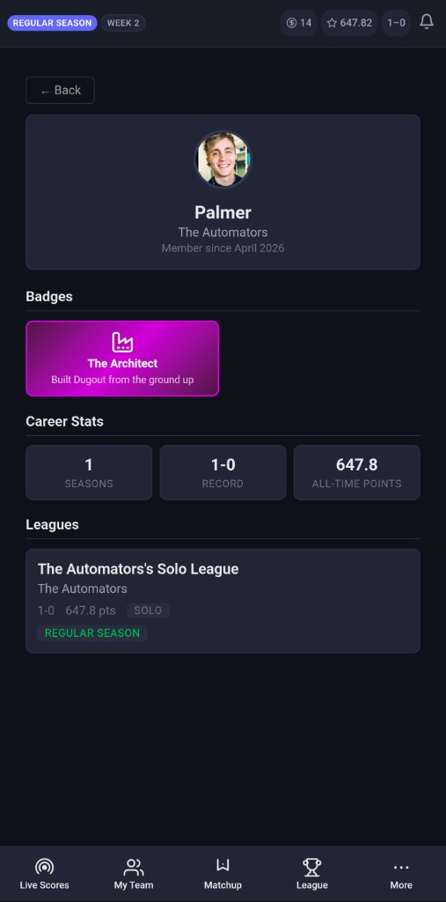

# Dugout — Fantasy Baseball RPG Platform

> Full-stack fantasy baseball with RPG equipment, a player-driven coin economy, and in-house ML on real MLB data. **Live production** app behind Docker, AWS RDS PostgreSQL, Redis, and Cloudflare (Tunnel + edge TLS).

**[Live app](https://dugoutfantasy.com)** · Private source · [Screenshots](SCREENSHOTS.md) · [Overview](#overview) · [Security](#security--production-hardening) · [Architecture](#architecture) · [ML pipeline](#ml-pipeline) · [System design](#system-design-highlights) · [Economy](#economy--balance-engineering) · [Ops](#operations) · [Testing](#testing)

---

## TL;DR

Dugout is a production fantasy baseball platform that combines RPG mechanics, real-time systems, and in-house ML. **Built entirely solo.**

- **Live production system** — deployed via Docker, AWS RDS PostgreSQL, Redis, and Cloudflare with real users and active seasons
- **Built entirely solo** — full ownership across ML, backend, frontend, infrastructure, and game design
- **Novel game design problem** — RPG gear system introduces new scoring categories (e.g., holds, foul balls), addressing structural gaps in traditional fantasy baseball
- **Autonomous bot managers** — AI-driven opponents handle drafting, trades, waivers, and lineup optimization across an entire season
- **Custom ML pipeline** — Marcel baseline → Statcast correction → gradient-boosted quantile models (p10/p50/p90); independent pitch-level role-transition research (rigorous negative result across 89 comparisons)
- **Real-time distributed system** — Redis-backed state + SSE for live scoring, draft rooms, and event-driven notifications
- **Performance engineering** — eliminated 29+ N+1 query paths (93–99% reduction), enabling 15s live updates at scale
- **Scale signals** — 1,355+ tests, ~200 gear items, 6 AI archetypes, 39-feature ML models, full production infrastructure

### Why this exists

Traditional fantasy baseball undervalues key roles (e.g., middle relievers) and lacks real-time engagement. Dugout redesigns scoring, incentives, and decision-making using ML and system design to better reflect real baseball value.

See below for architecture, ML pipeline, and system design.

---

## Screenshots

| My Team | Matchup Breakdown | Equipment | Shop |
|---------|-------------------|-----------|------|
|  |  |  |  |

| Profile & Badges | Research Leaderboard | Free Agents | Player Compare |
|-----------------|---------------------|-------------|----------------|
|  |  |  |  |

**[View all 28 screenshots →](SCREENSHOTS.md)** — landing, live scores, box scores, matchups, scoring breakdowns, league standings, gear locker, shop, catalogue, waivers, trades, projections, lineup optimizer, research hub, leaderboard, free agents, player compare, player deep-dive, team profiles, user profiles, notifications, and more.

---

## Overview

Dugout layers **RPG progression** on head-to-head fantasy baseball:

- **8 equipment slots** per player (hat, shades, chain, jersey, glove, bat, wristband, cleats) with **6 rarity tiers** (Common → Mythic).
- **~200 gear items** with challenge-based unlock triggers, performance-gated rarity rolls, and soulbound loot; **marketplace** resales with tax sinks. **Gear-created scoring categories** (holds, innings pitched, foul balls) turn traditionally worthless fantasy assets — setup men, middle relievers — into real point producers.
- **Auction draft** with an **AI advisor panel** (real-time bid/let-go recommendations, natural-language reasoning) and **bot opponents** that bid with distinct personalities. **Injury-aware auction values** — IL-eligible players receive 50% reduced opening bids. **Ready-up lobby** — pre-draft waiting room with tutorial cards, per-member readiness tracking (bots auto-ready), and commissioner force-start; prevents users from missing early picks.
- **6 bot personality archetypes** (Stars & Scrubs, Balanced, Value Hunter, Position Scarcity, Late Surge, Gear Grinder) — **persisted per bot** with **20 tunable knobs** per archetype, used **all season**: draft bidding, waivers, trades, marketplace, lineup optimization, gear equipping, **pitcher streaming**, and **shop buying**. **Leaderboard-aware waiver intelligence** — bots blend actual season performance from the Research Hub leaderboard with ML projections (sample-size-weighted ramp), so a player who's #2 on the leaderboard doesn't sit unclaimed on waivers because their projection is modest.
- **Flexible league sizes** — commissioners can **fill empty slots with AI managers** in pre-season. Play with 3 friends and 7 bots, or any mix.
- **Switch Mode** moves between Solo and League contexts with **independent rosters, gear, scores, and matchups**.
- **Live scoring** with 15-second box score polling, in-game fantasy point accrual with **gear snapshot freezing**, and **live box scores** with real-time current-batter highlighting (MLB ID matching via linescore API). **Merge-based frontend updates** — game state diffs are compared field-by-field so the UI only re-renders when data actually changes (no poll-cycle flicker). Yesterday's finals are auto-evicted from the live page once today's first pitch is thrown.
- **Event-driven notifications** — SSE-pushed instant alerts for every stat event (hits, walks, HRs, Ks, etc.) delivered faster than ESPN or Yahoo. Two-tier system (Highlights + Play-by-Play) with per-user granularity toggles. Web Push (VAPID) for OS-level notifications.
- **Play-by-play enrichment** — fielding credits (OF catches, double plays), ABS challenge tracking, trailing/go-ahead HR detection, foul ball counting from Statcast.
- **Automated callup detection** — multi-source pipeline (RSS feed NLP, MLB transactions API, nightly roster diffs, admin manual override) detects minor-league callups faster than the official API, auto-promotes players to the waiver wire, and pushes real-time notifications with **deep-link to waiver claim** (pre-fills search). Five-layer defense: title-segment scoping isolates multi-move headlines, sentence-scoped NLP scanning limits body context, per-article player cap bounds blast radius, speculation filter blocks rumors, and **MLB Stats API verification** confirms active roster status before any promotion fires.
- **Unified transactions** for waivers and trades; bots participate in both — including **bot-to-bot trades** — with personality-driven decision making and season-phase-aware trade throttling.
- **Research Hub** — a multi-tab player intelligence center (Search, Leaderboard, Free Agents, Compare) with Redis-cached rankings, position filtering, **pitcher designation sub-filters** (SP/CL/SU/MR/SW), waiver hold badges, and side-by-side player comparison. **Team profiles** show any team's full roster, trophy case, and gear loadout.
- **Marcel-anchored ML projections** (p10/p50/p90 ranges) with a 5-layer architecture: Marcel multi-year baseline → in-season blend → Statcast luck correction → gradient-boosted context adjustment (**39 hitter / 28 pitcher features**) → range construction. Recency-weighted training, pitch-level rolling stats, opposing-lineup quality, rest/fatigue modeling, and L/R platoon splits. Dedicated **Projections page** with animated pipeline progress, per-player confidence bars, matchup context, and Statcast chips.
- **Injury List management** — 2 IL slots that don't count against the active roster cap; **injury-aware bots** that auto-manage IL, discount injured players in trades and draft, and stash IL-eligible stars based on personality; **ESPN Day-to-Day scraper** as a supplemental injury data source.
- **Gear catalogue** tracks collection progress across all ~200 items with challenge conditions and rarity-grouped browsing.
- **Precision gear display** — every gear card shows the true effective boost after diminishing returns, not raw template values. Two-decimal precision across all surfaces (trophy case, locker, shop, catalogue, detail modals).
- **Slot occupancy indicators** in the Move Position menu — open slots highlighted green, occupied slots dimmed with the current player's name — so lineup decisions never require scrolling.
- **User profiles** with avatar upload (2MB max, JPEG/PNG/WebP, content-hash filenames, Docker volume persistence), username-based shareable routes (`/profile/:username`), career stats (all-time W-L, total points, seasons played), and active league cards.
- **Achievement badges** — auto-awarded at season end (champion, runner-up, third place, first season completed) with SVG icons and gradient theming by badge type. Admin-grantable special badges for milestones. Batch `IN` query for first-season dedup (no N+1).
- **Transaction export** — downloadable Excel (.xlsx) of all league transactions with league isolation and batch queries.
- **In-app guide** (10-section How to Play), **FAQ/Trust page**, **contact/status pages**, and **privacy/terms** — all built as first-class React views.

---

## Security & production hardening

Multi-layer security posture for a public-facing app with real users:

### Transport & headers

| Control | Implementation |
|---------|----------------|
| **TLS** | Cloudflare Tunnel — all external traffic is HTTPS with edge TLS termination |
| **HSTS** | `Strict-Transport-Security: max-age=63072000; includeSubDomains; preload` |
| **CSP** | `Content-Security-Policy` restricts scripts, styles, images, and connections to `'self'` + MLB CDN origins; `frame-ancestors 'none'` blocks clickjacking |
| **Security headers** | `X-Content-Type-Options: nosniff`, `X-Frame-Options: DENY`, `Referrer-Policy: strict-origin-when-cross-origin`, `Permissions-Policy` (no camera/mic/geo) |

### Authentication & secrets

| Control | Implementation |
|---------|----------------|
| **JWT** | HS256 access tokens via `PyJWT`; bcrypt password hashing (12 rounds); **auto-logout on 401** — expired tokens clear client-side and redirect to login |
| **Secret key** | App **crashes on startup** if `DUGOUT_SECRET_KEY` is missing or set to a known placeholder — no silent fallback to a default |
| **Docker Compose** | Uses `${VAR:?error}` syntax for `DATABASE_URL` and `DUGOUT_SECRET_KEY` — Compose refuses to start without secrets in `.env` |
| **Health endpoint** | Non-admin callers see only `{"status": "ok"}` — internal diagnostics (DB status, scheduler state, uptime) require admin API key |
| **Error sanitization** | API error responses return generic messages; exception details are logged server-side only, never leaked to clients |
| **Verification codes** | Generated with `secrets` module (CSPRNG); compared with `hmac.compare_digest` (timing-safe) |
| **Password reset** | Email-based 6-digit code via Resend; rate-limited (3 req/min send, 5/min reset); silent success on unknown emails to prevent enumeration |

### API security

| Control | Implementation |
|---------|----------------|
| **Auth-gated reads** | All data routes require `Authorization: Bearer` by default; optional `DUGOUT_ALLOW_PUBLIC_READS` for debugging |
| **SSE auth** | Live score / draft streams require JWT via `?token=`; per-user connection cap (max 5) prevents resource exhaustion |
| **Admin routes** | High-impact endpoints require `X-Admin-Key` matching `DUGOUT_ADMIN_API_KEY`; missing key → **404** (not 403) to prevent discovery |
| **Rate limiting** | `slowapi` with real client IP extraction (`CF-Connecting-IP` behind Cloudflare); auth endpoints (5-10/min), player search + research (30/min), global fallback |
| **CORS** | Explicit origin allowlist, restricted to `GET/POST/PUT/DELETE/PATCH/OPTIONS` methods and `Authorization/Content-Type` headers only |
| **Input validation** | Pydantic v2 models on all request bodies; query param bounds (`limit` capped at 200); typed path parameters |
| **OpenAPI hidden** | `/docs`, `/redoc`, `/openapi.json` disabled in production (active in dev mode only) |
| **Path traversal** | SPA fallback verifies resolved file paths stay within the static directory |
| **Manual scoring** | Gated behind `DUGOUT_ALLOW_MANUAL_SCORING` env flag — disabled in production to prevent stat injection |

### Dependencies & build

| Control | Implementation |
|---------|----------------|
| **Pinned versions** | All packages pinned with upper bounds (e.g., `fastapi>=0.115.0,<1.0`) to prevent breaking upgrades |
| **Multi-stage Docker** | `python:3.12-slim` final image; `pip install --no-cache-dir`; only necessary system packages |
| **Global error handler** | All unhandled exceptions return generic `{"detail": "Internal server error"}` — no stack traces leak to clients |

---

## Architecture

```
┌──────────────────────────────────────────────────────────────┐
│              Cloudflare (TLS, Tunnel, optional cache)         │
└──────────────────┬───────────────────────────────────────────┘
                   │
┌──────────────────▼───────────────────────────────────────────┐
│  Docker Compose                                               │
│                                                               │
│  ┌─────────────────────────────────────────────────────────┐  │
│  │  app (Gunicorn + Uvicorn workers)                       │  │
│  │  ┌──────────┐  ┌───────────┐  ┌──────────────────────┐   │  │
│  │  │ FastAPI  │  │ React SPA │  │ APScheduler          │   │  │
│  │  │ REST API │  │ (Vite)    │  │ (jobs, scoring, ML)  │   │  │
│  │  └────┬─────┘  └───────────┘  └──────────┬───────────┘   │  │
│  │       │  ┌──────────────────┐  ┌─────────▼──────────┐   │  │
│  │       └─►│ SQLModel / PG    │  │ ML stack           │   │  │
│  │       │  └──────────────────┘  │ GBR quantile,      │   │  │
│  │       │  ┌──────────────────┐  │ GMM, draft agent,  │   │  │
│  │       └─►│ Redis (pub/sub   │  │ lineup optimizer   │   │  │
│  │          │  + shared cache) │  └────────────────────┘   │  │
│  │          └──────────────────┘                            │  │
│  └──────────────────────────────────────────────────────────┘  │
│  └──────────────────────────────────────────────────────────┘  │
└──────────┬───────────────────────────────────────────────────┘
           │
┌──────────▼───────────────────────────────────────────────────┐
│  AWS RDS PostgreSQL 16          Redis 7 (ephemeral, in-app)  │
│  (managed, automated backups)                                 │
└──────────────────────────────────────────────────────────────┘
```

| Layer | Stack |
|-------|-------|
| **Frontend** | React 19, TypeScript, Vite, Zustand |
| **Backend** | FastAPI, SQLModel, Pydantic v2, Uvicorn/Gunicorn |
| **Database** | AWS RDS PostgreSQL 16 (managed, automated backups, `pool_pre_ping` + connection recycling) |
| **Cache/PubSub** | Redis 7 — cross-worker SSE broadcast (pub/sub), shared game cache, derived scoring TTL cache, **leaderboard pre-computation cache**, **distributed draft room state** |
| **ML** | scikit-learn (`HistGradientBoostingRegressor`, GMM), NumPy, pandas, joblib |
| **Real-time** | SSE (`sse-starlette`) — draft room, live scores, and **event-driven notifications**; Web Push (VAPID) for OS-level alerts |
| **Data** | MLB Stats API (rosters, depth charts, game logs, play-by-play, transactions), Statcast (pybaseball), **ESPN DTD injury scraper**, **RSS callup watcher** (MLB Trade Rumors, ESPN — feedparser + NLP speculation filter) |
| **Auth** | JWT + bcrypt, email verification + password reset (Resend) |
| **Infra** | AWS EC2 + **RDS PostgreSQL** (7-day automated backups, point-in-time recovery), Multi-stage Docker image, Cloudflare Tunnel |

---

## ML pipeline

### 1. Player projections — Marcel-anchored ML

Five-layer projection architecture combining sabermetric priors with gradient-boosted ML, modeled after how professional systems (ZiPS, Steamer) blend actuarial baselines with in-season data:

```
┌─────────────────────────────────────────────────────────────┐
│  Layer 1 — Marcel Baseline                                   │
│  PlayerSeasonStats (2023–2025) → 5/4/3 year weighting →     │
│  regression to mean → age adjustment                         │
├─────────────────────────────────────────────────────────────┤
│  Layer 2 — In-Season Blend                                   │
│  Marcel anchor + 2026 game logs (0% → 65% ramp over 80 G)  │
├─────────────────────────────────────────────────────────────┤
│  Layer 3 — Statcast Luck Correction                          │
│  xBA/xSLG/xERA vs actual → ±15% adjustment                  │
├─────────────────────────────────────────────────────────────┤
│  Layer 4 — ML Context Adjustment                             │
│  HistGradientBoostingRegressor p10/p50/p90 (39H / 28P       │
│  features) → clamped ±25–35% nudge on anchor                 │
├─────────────────────────────────────────────────────────────┤
│  Layer 5 — Range Construction                                │
│  p10/p90 from ML quantiles or sensible anchor-based defaults │
└─────────────────────────────────────────────────────────────┘
```

**Layer 1 — Marcel baseline:** Multi-year weighted projection using `PlayerSeasonStats` (2023–2025). Weights years 5/4/3 (most recent heaviest), regresses rate stats toward league average based on **raw** career volume (not inflated by year weights), and applies an age curve from `Player.birth_year`. Two-way players get combined `hitting_value + (pitching_value × starts_per_game_ratio)` — their full fantasy value, not just one side.

**Layer 2 — In-season blend:** As 2026 game logs accumulate, blends the Marcel baseline with actual `PlayerGameLog` performance. Ramp: 0% actual at 0 games → 65% actual at 80 games. Prevents early-season volatility from overriding multi-year track records.

**Layer 3 — Statcast enhancement:** Applies "luck correction" adjustments (up to ±15%) based on differentials between expected stats (xBA, xSLG, xERA from pybaseball) and actual stats. A hitter with a .220 BA but .280 xBA gets an upward nudge — their batted ball quality suggests regression toward better results.

**Layer 4 — ML context adjustment:** Three **`HistGradientBoostingRegressor`** models per player type (hitter/pitcher) produce **p10, p50, p90** quantile predictions. The ML p50 is used as a contextual "nudge" (clamped ±25–35%) on the Statcast-enhanced anchor — not as the sole prediction.

**Layer 5 — Range construction:** p10/p90 from ML quantile models or sensible defaults based on the enhanced anchor.

**Hitter feature set (39 features):**
- **17 box-score rolling:** 5g/15g rolling averages for hits, HR, RBI, runs, SB, walks, doubles, fantasy points; season AVG/OBP/SLG; hit streak length; games played
- **11 Statcast season:** xBA, xSLG, xwOBA, BA/SLG/wOBA differentials (expected vs actual), avg exit velocity, barrel%, hard-hit%, sweet-spot%, avg launch angle
- **5 matchup context:** park factor, platoon advantage, opposing pitcher xERA/xwOBA, **platoon wOBA differential** (player-specific split quality)
- **2 rest/fatigue:** days since last game, games in trailing 7 days
- **4 pitch-level rolling:** recent max exit velocity, barrel rate, whiff rate, hard-hit rate (5-game windows from persisted Statcast game summaries)

**Pitcher feature set (28 features):**
- **12 box-score rolling:** 5g/15g rolling IP, K, ER, hits allowed, fantasy pts; season ERA/WHIP; games played
- **7 Statcast season:** xBA/xSLG/xwOBA against, xERA, avg exit velo against, barrel% against, hard-hit% against
- **4 matchup context:** park factor, **opposing team wOBA/K%/barrel%** (aggregated from per-batter Statcast)
- **2 rest/fatigue:** days since last game, games in trailing 7 days
- **3 pitch-level rolling:** avg pitch speed, whiff rate, called-strike% (5-start windows)

**Key design decisions:**
- **Marcel methodology:** Industry-standard approach (Tango/Lichtman) — 5/4/3 year weighting, regression to the mean proportional to sample size, age adjustment. The same foundation ZiPS and Steamer use, implemented from scratch against `PlayerSeasonStats`
- **Raw volume for reliability:** Career IP/PA (not year-weighted) determines how much to regress. Starters use a 400 IP denominator; **relievers use 150 IP** (calibrated for ~60 IP/year closers vs ~180 IP/year starters). Without this, a closer with 150 career IP gets 0.38 reliability and ~65% of their elite K/save rates regressed to mediocre league averages
- **Two-way player handling:** TWP players get combined hitting + prorated pitching value — Ohtani's full fantasy value, not just one half
- **No-leak training:** Sliding window ensures features only come from games *before* the target game
- **Recency-weighted training:** Exponential decay sample weights (`0.5^(days_ago / 30)`) passed to `HistGradientBoostingRegressor.fit()`
- **Model versioning:** Feature fingerprint (SHA-256) persisted alongside models; stale models auto-rejected with immediate retrain — prevents silent degradation
- **Confidence scoring:** Composite of Marcel data availability, Statcast coverage, game log count, prediction consistency (inverse quantile variance), and in-season blend weight
- **League scoring ratio:** Rescales predictions by (league-weights / default-weights) so custom scoring leagues get adjusted projections
- **Weekly scaling:** per-game projection × estimated weekly appearances (hitters: team games; SP: ~1.2/week; RP: ~60% of team games)
- **Matchup resolver:** Today's opposing pitcher, platoon advantage, opposing-lineup quality from cached Statcast
- **Auto-retraining:** Models retrain via joblib after every batch of completed games; startup retrain if stale

### 2. Tier classification & pitcher role assignment

Role-aware **absolute thresholds** on `projected_pts_per_game` with separate cutoffs per pool:

| Role | Star | Starter | Platoon | Bench |
|------|------|---------|---------|-------|
| Hitter | ≥ 7.0 | ≥ 4.5 | ≥ 2.5 | < 2.5 |
| SP | ≥ 14.0 | ≥ 8.0 | ≥ 4.0 | < 4.0 |
| RP | ≥ 6.0 | ≥ 3.5 | ≥ 2.0 | < 2.0 |

**Career volume guards:** Projection-based tiers are capped by career volume thresholds from `PlayerSeasonStats`. A pitcher can't be Star with < 150 career IP (starters) or < 50 IP (relievers); a hitter can't be Star with < 400 career PA. This prevents small-sample overconfidence — a prospect with 96 career IP who projects well still caps at Starter until they prove durability.

**Two-way player handling:** TWP players (Ohtani) are always classified as hitters for tiering purposes — their pitching adds value but shouldn't push them into SP-tier thresholds where combined value doesn't reach "Star." The Marcel projection already combines both sides, so the hitter threshold captures their full fantasy impact.

**Granular pitcher roles (`PitcherRole`):** Beyond SP/RP, every pitcher is classified into one of 6 roles based on aggregated `PlayerSeasonStats`:

| Role | Criteria |
|------|----------|
| **STARTER** | ≥ 50% games started |
| **CLOSER** | < 50% GS, ≥ 5 career saves with ≥ 15% save rate |
| **SETUP_MAN** | RP with ≥ 1.0 IP/appearance and high K rate (≥ 0.8 K/IP) |
| **SWINGMAN** | RP with ≥ 1.5 IP/appearance (long relief / spot starts) |
| **MIDDLE_RELIEVER** | Default RP classification |
| **UNKNOWN** | Insufficient data |

Pitcher roles feed into **gear equip restrictions** (Saves+ gear only on closers/setup men, Wins+ only on starters/swingmen) and loot drop pool filtering.

**Other guards:** Small-sample cap (HR<5, RBI<15 → can't be Star/Starter); everyday floor (120+ games → can't fall below Platoon). Tiers feed loot rarity gates, draft auction valuations, and projection confidence.

### 3. Auction pricing engine

Position-aware **piecewise linear curves** map `projected_pts_per_game` to draft dollars, calibrated against the production database's actual ppg distribution:

- **Hitter curve** (weekly = ppg × 6.5): four segments from bench ($1) through generational ($60+) with a 35% budget cap
- **Pitcher curve** (weekly = ppg × 2.0): four segments tuned so ace SPs ($25–30) never outbid elite everyday hitters
- **Closer premium:** relievers receive a tier-based floor ($10–18) despite low ppg from 1 IP/game
- **Multiplier cap** (2.0×) prevents any single bot modifier chain from producing runaway bids

Designed so: Ohtani settles ~$55–90, star hitters ~$25–55, ace SPs ~$20–40, mid-rotation ~$5–15, bench ~$1–5.

### 4. Draft AI advisor

Real-time **bid / let-go** recommendations during the auction:

- Combines **auction value**, **positional scarcity**, **roster need**, and **budget advantage** into a composite score
- Four action tiers: **Must Have**, **Bid Aggressively**, **Bid Moderately**, **Let Go** — with natural-language reasoning
- **Injury-aware:** IL-eligible players are flagged in reasoning with status labels (IL10, IL60)
- Local bid tracking: when the price rises past the recommended ceiling, the panel updates instantly (no API round-trip)
- Uses the same pricing curves and projections as bot valuations, so advisor recommendations align with the market bots create

### 5. Lineup optimizer

Two modes — **weekly** and **daily matchup-aware** — sharing a constrained greedy assignment engine (two-pass: most-constrained positional slots first, then flex/utility with best remaining).

**Weekly optimizer:** Uses projection engine for (per-game pts × games this week × gear boost fraction). Same diminishing-returns and positive-cap pipeline as live scoring for gear.

**Daily optimizer:** Full matchup-context scoring for today's games. Each player is scored by `project_player()` with today's opposing pitcher, platoon splits, park factor, injury status, and gear modifiers. Off-day players and injured starters are automatically benched. **Multi-day lookahead** fetches the 2-day upcoming schedule — players who only play today (no games in the next 2 days) receive a scarcity bonus as a tie-breaker, preventing "wasted" starts. Rich matchup detail is surfaced per-slot: opposing SP (with handedness), venue + park factor, platoon advantage/disadvantage, "Today Only" badge, and SP probable status. Natural-language reasoning explains every START/BENCH decision. Respects roster locks (won't move players whose MLB games have started).

**Auto-daily integration:** The daily optimizer powers the automated lineup cron job for bots and opt-in human users (`auto_lineup` toggle), replacing the simpler weekly optimizer for daily management. The "Smart Swap" button on the Team page also uses the daily optimizer for one-tap matchup-aware lineup optimization.

Product messaging: **in-house statistical ML**, not generative AI.

### 6. Pitcher role-transition research (sandbox)

Independent research module (`dugout/sandbox/`) investigating whether **pitch-level Statcast data** could beat flat league-average conversion factors for projecting SP↔RP transitions. Built a full pipeline from scratch: 50+ pitcher registry, Statcast scraper (447 parquet files, 2015-2025), pitch-by-pitch arsenal decomposition, structural role-transition features, and a cross-validated backtest with statistical significance testing.

**What was tested:**
- Bottom-up stat prediction (K/PA, BB/PA, xwOBA) from per-pitch-type outcome models
- Velocity/spin/movement deltas between roles
- Third-time-through-order penalty, pitch sequencing entropy, fatigue resilience curves, platoon exposure shifts
- Three architectural iterations (raw replacement, modulation, structural signal modulation)

**Result: negative.** Across 89 cross-validated comparisons on 50+ pitchers, none of the three architectures produced statistically significant improvement over flat conversion factors (all p > 0.05, Cohen's d < 0.2). The per-pitcher signal exists for specific arms but is drowned by game-to-game scoring noise at the population level.

**Why it's here:** A rigorous negative result is still a result. The research demonstrates the full pipeline — data engineering, feature extraction, model architecture, cross-validation with significance testing — and the discipline to measure honestly and stop when the data says stop. The infrastructure (registry, scraper, validation harness, 256 tests) is preserved for future approaches.

---

## System design highlights

### Research Hub

Multi-tab player intelligence center — the primary discovery surface for all roster decisions:

- **Search:** Debounced player search (300ms) with Browse by Team grid (all 30 MLB teams). Player deep-dives show MLB Stats API season stats, last 10 game logs, Dugout fantasy context (tier, pitcher role, projection, ownership, equipped gear count), today's matchup, and **Statcast chips** (xBA, barrel%, hard-hit%, etc.).
- **Leaderboard:** Ranked by actual accrued fantasy points from `PlayerGameLog` aggregates (not projections). Sortable by Season Pts / Pts/Game / Projected, filterable by position (All, C, 1B, 2B, 3B, SS, OF, DH, P), paginated (25/page with Load More). Per-league ownership badges. **Redis-cached** with 5-minute background refresh via APScheduler — reads are near-instant. **Pitcher designation sub-filter:** when position = P, a secondary pill bar appears for Starter / Closer / Setup Man / Middle Reliever / Swingman — backed by the same `PitcherRole` classification used for gear restrictions.
- **Free Agents:** Same filterable/sortable/paginated view as leaderboard, filtered to unowned players. Same pitcher designation sub-filter. **Waiver hold badges** show the exact date a recently-dropped player becomes available — no guesswork.
- **Compare:** Side-by-side comparison of up to 3 players with season stats, fantasy point estimates, ML projections, tier badges, and ownership.

**Season Points Estimator:** Per-player endpoint applies the league's scoring weights to MLB season stats, producing a category-by-category breakdown with totals and per-game averages. Custom scoring leagues get correctly weighted estimates.

**Team Profiles:** Full team pages with active roster (ownership overlay), upcoming 7-day schedule, division standings (W/L/GB), and team logos.

### Real-time draft room

**Redis-backed auction state machine** (nomination → bidding → timers) with **SSE** fan-out. Authoritative `DraftRoom` state is serialized to Redis (`dugout:draft:room:{league_id}`) so all Gunicorn workers can read/write draft state — bids, nominations, and auto-nominate toggles work regardless of which worker handles the request. **Distributed locking** (`dugout:draft:lock:{league_id}`) serializes concurrent mutations (bid races, timer expiry) across workers. League-ID-scoped keys provide complete isolation for concurrent drafts. 4-hour TTL auto-expires abandoned rooms. Graceful fallback to in-memory state when Redis is unavailable (local dev).

**Bot bidding engine:** 6 personality archetypes with per-archetype knobs (tier multipliers, bid increments, timing profiles, drain nomination probability). Highest-valuation bot bids first; personality-aware increments; "fight" behavior where bots near their ceiling occasionally push 5–20% beyond. **Pass chance** (0–50%) creates natural "steal" windows. **Position-diversity nomination** tracks a sliding window of last 5 picks — if 4+ pitchers, forces a hitter and vice versa. **Gear Grinder trigger-hunter nudge:** boosts draft valuations 10–12% for high-K pitchers and high-volume hitters whose stat profiles trigger more gear drops.

**AFK assistance:** after 10 picks without activity, AI nominates via the draft agent; bidding uses incremental raises with a "desperate roster" path so late-draft $1 fills still happen when roster slots outpace budget headroom.

**Per-user auto-nominate:** Each drafter independently toggles whether AI nominates on their turn — not a league-wide switch. When enabled, the server-side `_schedule_next_nomination` checks the current nominator's `DraftMember.auto_nominate` flag and dispatches AI nomination only for that member. Toggling mid-draft immediately triggers or cancels AI nomination if it's your turn, with real-time SSE broadcast of the per-user state change to all clients.

**Pitcher pacing:** enforces filling 9 pitching lineup slots (Yahoo-style) so teams don't end draft-heavy on hitters. Bots always auto-nominate on their turn regardless of human settings — so drafts don't stall.

**Ready-up lobby:** Before the auction clock starts, the draft room opens a **lobby phase** where all participants see 5 tutorial cards explaining draft mechanics, and each member must explicitly mark themselves "ready." Bots auto-ready on room creation; the commissioner can force-start at any time. The lobby state (`lobby: bool`, `ready_members: set[int]`) is part of the Redis-backed `DraftRoom` — serialized, locked, and broadcast via the same distributed infrastructure as bids. Two dedicated endpoints (`POST /draft/ready`, `POST /draft/begin`) manage the transition; `member_ready` SSE events update all clients in real time. Push notifications ("Draft Lobby Open! Tap to join.") link directly to the lobby screen so users never bypass the tutorial or miss early picks. **Non-blocking won-toast:** When a player is won, a slide-in toast appears at the top of the draft UI instead of a full-screen overlay — users can continue watching the draft without interruption, especially critical on mobile.

**Injury-aware draft:** IL-eligible players receive 50% reduced opening bids and auction valuations, with injury status displayed in the draft room and advisor reasoning.

### Live scoring pipeline

15-second **MLB Stats API polling** → detect in-progress games → fetch box scores → compute fantasy points with **gear modifier engine** (caps, diminishing "all" stacks, penalties after cap) → update `FantasyLiveAccrual` rows with delta tracking → **SSE broadcast** to connected clients.

**Gear snapshots** are frozen at first accrual so mid-game equipment swaps don't retroactively change scoring. **Every `UserPlayerGameScore` row** — starters and bench — stores a complete `gear_snapshot_json` recording exactly which gear pieces were equipped at the time of scoring. This creates an immutable audit trail: when scoring discrepancies are reported, the historical gear state can be replayed against game stats to verify the exact point calculation. Snapshots are surfaced in the scoring breakdown UI for full transparency.

When games go final: reverse all live accruals → apply authoritative final scoring with **Statcast enrichment** (foul balls, barrel data, pitch speeds) → **play-by-play parsing** (fielding credits, ABS challenges, trailing HR detection) → loot rolls → coin grants → persist `PlayerGameLog` for ML retraining.

**Stale accrual reconciliation** runs every tick — cleans up phantom rows from postponed/cancelled games, zeroes orphaned accruals from interrupted deploys.

**Live box scores** show real-time batting and pitching lines for every in-progress game. The **current batter is highlighted** dynamically by matching the MLB linescore API's batter ID against box score player IDs — updates automatically via SSE as each new batter steps up.

**Midnight ET boundary handling:** Games that extend past midnight (extras, rain delays, West Coast late starts) maintain correct roster locks, scoring attribution, and stat display by checking both today's and yesterday's schedule until 6 AM ET. Prevents premature unlocks and missing game cards.

### Event-driven live notifications

Two-tier notification system — **Live Highlights** and **Play-by-Play** — delivered via **SSE push** (not polling), with each tier independently toggleable per user in settings.

**Architecture:** The backend scoring loop detects stat events as they happen within each 15-second MLB API tick. Events are broadcast instantly over the existing SSE connection (the same channel used for live scores) as `new_notification` events. The frontend `NotificationBell` listens for these events and updates the unread count in real-time — zero polling delay. **Web Push (VAPID)** fires in parallel for OS-level notifications even when the browser tab is closed.

**Result:** Notifications arrive within seconds of the MLB API reporting the event — faster than ESPN or Yahoo, which batch-process on longer intervals with cooldown windows. No per-player cooldowns; every event fires individually.

**Live Highlights:** HRs (including multi-HR games), triples, multi-hit games (3/4/5+), stolen bases, RBI milestones (3+/5+), K milestones (8/10/12+), wins, saves, quality starts. **Gear proximity hints** tell users they're close to unlocking specific items ("1 more K for Nolan Ryan Rancher").

**Play-by-Play:** Every positive stat event — singles, doubles, walks, runs scored, individual RBIs, individual pitching strikeouts. Gives engaged users a real-time feed of their roster's performance without needing to watch every game.

### Injury List management

Full IL overhaul with **2 IL slots** that don't count against the 24-player active roster cap (MAX_ROSTER = 26):

- **`is_il_eligible()`** validates against MLB injury designations: IL10, IL15, IL60, DTD (case-insensitive).
- **Bot IL management:** `_manage_bot_il()` automatically moves injured players to IL slots and activates recovered players.
- **Injury-aware bot trades:** Personality-specific `injury_discount` (0.0–1.0) applied to trade valuations. Value Hunter bots stash injured Stars/Starters; Late Surge bots avoid injured players near playoffs.
- **Droppable overrides:** Stars are normally undroppable, but injured Stars become droppable when IL slots are full — strategic roster decisions.
- **ESPN DTD scraper:** Supplemental `poll_dtd()` job scrapes ESPN's Day-to-Day injury page with name normalization, merging with MLB API transaction data without overwriting more severe designations.
- **Injury badges** displayed across all surfaces: draft room, research, waiver wire, team profiles, player search results.

### Waiver system

Daily processing at **8 AM ET**. Dropped players sit on waivers for **2 days** before becoming free agents. Bot waiver engine runs in phases: replace injured starters → fill empty slots by positional need → positional rebalancing → upgrade worst bench player (personality-gated) → **pitcher streaming**. Tier-aware drop protection (Stars never droppable; Starters require 3× projection margin). Value Hunter bots stash IL-eligible Stars/Starters.

**Leaderboard-aware evaluation:** Bots read the Redis-cached Research Hub leaderboard and blend each FA's actual season `pts/game` with their ML projection, weighted by sample size: `weight = min(gp / 80, 0.5)`. At 0 GP the bot trusts projections entirely; by 40 GP, actual performance carries 50% weight. This prevents the classic AI blind spot where a player performing at #2 on the leaderboard sits unclaimed because their pre-season projection was modest. The blend applies only to free agent candidates — roster players keep raw projection + gear bonus so bots don't panic-drop a geared-up player having a cold week.

**Pitcher streaming (Phase 3):** Bots mimic the competitive human strategy of dropping bench SPs with no upcoming starts and claiming FA starters who pitch within a **3-day lookahead window** (single MLB Stats API call with date range). Multi-layer decision pipeline:

- **Schedule-aware spent detection:** A bench SP is only considered "spent" if their team has NO game in the entire 3-day window. Pitchers with a start on day+2 or day+3 are kept — a human would hold them.
- **Hold-aware FA targeting:** Queries `WaiverHold` to filter out FAs still on waivers past their game date. FAs are scored by `(soonest start ASC, projection DESC)` to prioritize immediately available arms.
- **Gear-aware sliding scale:** Instead of a binary gear cutoff, gear value inflates the pitcher's effective projection using `gear_val × (1.0 − streaming_aggression)`. Aggressive bots (Stars & Scrubs, aggression=0.70) discount gear heavily — they'll eat a Rare hat loss for a stud stream target. Conservative bots (Value Hunter, aggression=0.15) protect gear investment. **Legendary+ gear stacks (≥ 0.35 bonus) are always protected** — no human drops those.
- **FA must justify the swap:** Stream targets must project higher than the spent pitcher's gear-inflated effective value. No more blindly replacing a good pitcher with a mediocre one just because the schedule says so.
- **Personality-driven gating:** `streaming_aggression` (daily probability, 0.15–0.70 by archetype) and `streaming_max_per_week` (1–4 cap) control volume. Late Surge bots scale aggression with the season-phase multiplier. Gear Grinder bots stream conservatively (aggression=0.20, 1/week) — they're focused on gear, not pitching matchups.

**Phase 2 personality gating:** Bench upgrades are probabilistically gated by `phase2_upgrade_chance` (0.40–0.80 by archetype). Stars & Scrubs bots upgrade 80% of the time; Value Hunter bots only 40%. Late Surge bots scale their chance with the season-phase surge multiplier. This simulates a human "holding" bench players for upcoming matchups rather than mindlessly optimizing every night.

**Waiver hold visibility:** Player search results and the Research Hub's Free Agents tab surface waiver hold status inline with date badges — users see exactly when a recently dropped player becomes available without navigating away. Enhanced denial notifications explain *why* a claim was denied (hold window, roster cap, position eligibility) so users aren't left guessing.

### Bot trade engine

**League-wide rolling 7-day cap** scales with the season: 2 proposals/week early (>10 weeks to playoffs) → 3 mid-season → 5 near playoffs (≤4 weeks). Per-bot attempt chances are low (6–14%) so proposals trickle in organically. **Bots trade with any league member** — humans and other bots alike — so the marketplace feels active even in solo mode. Trade matching finds same-position-bucket players within the personality's max projection gap; 60/40 bias toward best trade vs. random. Incoming trade acceptance uses personality-specific `accept_min_ratio` and `accept_min_surplus` thresholds with injury discount. Late Surge bots ramp via a multiplier (1.0× → 1.6×) as playoffs approach.

### Bot marketplace intelligence

Bots don't just randomly list and buy gear — they make personality-driven decisions that mimic engaged human players. **Gear Grinder bots** are the most active marketplace participants (~2.5× the listing rate of Value Hunters), sell at discount for volume (`greed_markup=0.92`), pay full retail for upgrades, and **buy from the weekly shop** aggressively (`shop_buy_eagerness=0.70`):

- **Smart listing:** Before listing rare+ gear, bots check if the item would be an upgrade for one of their own starters. If it would, they hold it — even if they could profit from the sale.
- **Stale listing management:** Unsold listings older than 48 hours are automatically repriced (25% discount) or salvaged for coins (40% chance), keeping the marketplace fresh.
- **Staggered per-bot timing:** Each 90-minute economy cycle schedules individual bot actions with random 0–30 minute jitter via `threading.Timer`, so marketplace activity is scattered throughout the day instead of all bots acting simultaneously.
- **Bot-to-bot transactions:** Bots buy from and trade with each other — not just humans — creating organic marketplace churn that mirrors a real multi-player league.

### Trade-waiver conflict guards

When a player is involved in both pending trades and waiver claims, the system resolves conflicts chronologically without blocking either flow:

- **Waiver drop of a traded-away player:** When a trade resolves and a player moves to a new team, any pending trade proposals from the original owner that include that player are **auto-cancelled** with a notification explaining why.
- **Trade proposal for a waivered player:** If a user drops a player to waivers while they have pending trade proposals involving that player, the proposals stay open until trade resolution time. At resolution, the system detects the player is no longer on the proposer's roster and cancels the affected proposals.
- **Multiple overlapping proposals:** Users can open 12 trade proposals involving the same player. If that player gets waivered, all affected proposals are cleaned up at the next trade resolution cycle — no manual intervention needed.
- **Waiver claim on a player in a pending trade:** The waiver system checks roster state at processing time (8 AM ET), not at claim time. If a trade moved the player before waivers process, the claim is voided.

### Stat correction pipeline

Daily job re-fetches yesterday's box scores from the MLB Stats API and diffs scoring events against persisted `PlayerGameLog` rows. When corrections are detected: individual `UserPlayerGameScore` rows are updated, the **correct historical week's** `WeeklyMatchup` is identified from `game_date` (not just the current week), and points are reconciled — even for already-completed weeks. League-wide notifications announce affected players. Scoring breakdowns in the UI tag corrected games with a "CORRECTED" badge and display per-stat deltas (field, old → new, point impact).

**Week finalization reconciliation:** Before marking a week `completed`, `finalize_week_matchups` re-derives all team points from the authoritative `UserPlayerGameScore` ledger, eliminating floating-point drift between accumulated live accruals and the source-of-truth detail rows.

### Matchup history & score auditing

Clickable matchup history rows expand inline to show the full player-by-player scoring breakdown for any past week — reusing the same detail endpoint and rendering as the current week's view. The history endpoint re-derives the user's own points from the authoritative ledger for all weeks; opponent points use stored (reconciled) values for completed weeks and live re-derivation for the current week.

### MLB transaction monitoring

Every 15 minutes: poll MLB transactions API for injuries, DFA, trades, activations. Auto-updates player `injury_status` and pushes notifications to roster owners ("Justin Verlander placed on 15-day IL"). **ESPN DTD scraper** supplements the MLB API with Day-to-Day designations that the official feed sometimes omits.

### Callup detection & waiver wire automation

Three-vector system that detects minor-league callups faster than the MLB Stats API's official roster designation changes, automatically promoting players to the waiver wire and notifying users via push notification:

**Problem:** When a top prospect gets called up, the MLB API's `rosterType` often lags behind beat reporters by hours. Fantasy managers on ESPN/Yahoo who hear the news first gain a massive waiver advantage. Dugout closes this gap with a multi-source detection pipeline.

**Architecture:**

```
┌──────────────────────────┐
│  Vector 1: RSS Watcher   │  ← MLB Trade Rumors, ESPN (15 min)
│  feedparser + NLP filter  │
├──────────────────────────┤
│  Vector 2: Transactions  │  ← MLB Stats API transactions (15 min)
│  poll_transactions()      │
├──────────────────────────┤
│  Vector 3: Roster Sync   │  ← 40-man roster diff (nightly 5 AM ET)
│  sync_all_players()       │
├──────────────────────────┤
│  Vector 4: Admin Manual  │  ← POST /admin/promote-player
│  Beat reporter → admin    │
└────────────┬─────────────┘
             ▼
┌──────────────────────────┐
│  MLB API verification    │  ← confirms active roster status
│  Player.is_minor_league  │  ← flips False → available on waivers
│  Push notification       │  ← "Callup: Noah Schultz (P, CWS)"
│  Deep-link: /waivers?claim=Name
│  SSE broadcast           │  ← real-time UI update
└──────────────────────────┘
```

**RSS callup watcher (`callup_watcher.py`):** Parses RSS feeds from MLB Trade Rumors and ESPN every 15 minutes. Multi-stage pipeline with five layers of false-positive defense:

1. **Trade title filter:** Headlines containing trade, acquisition, signing, free agency, injury, extension, DFA, minor league deal, or retirement keywords are immediately skipped — these articles are never the primary source for a callup, and their bodies routinely mention dozens of active players in passing (e.g., an injury roundup referencing 60+ players). A callup-verb override (`"promote"`, `"recall"`, `"select"`) allows through articles where the headline itself describes a promotion.

2. **Keyword classification with title-segment scoping:** Regex patterns identify callup, option, or irrelevant articles from headlines and summaries. Covers 15+ phrasings ("called up", "promoted", "recalled", "selected", "added to active roster", "contract purchased", "designated for assignment", "optioned", "sent to minors", etc.). When both callup and option keywords appear in the same article (e.g., "Orioles Select Sam Huff, Designate Jayvien Sandridge"), the article is classified as `"both"` and **the title is split on commas/semicolons** so each path only sees its own relevant segment — the callup scan sees "Orioles Select Sam Huff" while the option scan gets only body sentences with DFA keywords. This prevents a DFA'd player's name from leaking into the callup path (or vice versa) when both appear in the same headline.

3. **Speculation filter:** Prevents false positives from rumor articles. `_SPECULATION_PATTERNS` detect phrases like "expected to", "likely to", "weighing", "rumored", "could be" (with modal-verb disambiguation so "May" the month doesn't false-match); `_CONFIRMED_PATTERNS` detect definitive language ("have promoted", "officially", "announced"). Standalone past-tense verbs ("recalled", "promoted") use negative lookaheads to avoid matching speculative frames ("likely to be recalled"). If speculation is detected without a confirming override, the article is skipped. Articles older than 2 hours are also skipped to prevent reprocessing stale RSS entries after container restarts.

4. **Sentence-scoped DB-scan:** Primary strategy pre-indexes all known minor-league player names (Unicode-normalized for accents/suffixes via `unicodedata.normalize('NFD')`). Rather than scanning the full article body — which caused mass false positives when a single MLBTR article mentioned 30+ players in passing — the scanner extracts only sentences containing the relevant action keyword (`_keyword_sentences` strips HTML, splits on sentence boundaries, and returns only matching sentences). Player names are then matched against this scoped text using word-boundary regex. A **per-article cap** (`_MAX_PLAYERS_PER_ARTICLE = 3`) provides a hard safety valve. Falls back to regex-based name extraction from headlines when the DB scan finds no matches.

5. **MLB Stats API verification gate:** Before any `is_minor_league` flag is flipped, the system calls the MLB Stats API (`statsapi.get("person")`) to confirm the player's real-time roster status code. Promotions are blocked unless the API confirms active status (`A`, `D10`, `D15`, `D60`, `SU`, `RL`, `PL`); demotions are blocked if the API shows the player is still active. Falls back to optimistic behavior if the API is unavailable, so RSS still functions during outages. Also updates the player's team to their current MLB team as a side effect.

**`is_minor_league` flag:** Boolean on the `Player` model. Set during 40-man roster seeding (players with MLB status codes like "MIN", "NRI" are flagged). Filtered from all player-facing queries — draft pool, waiver wire, research leaderboard, free agents, bot transactions, player search — so minor leaguers never appear until promoted.

**Notification pipeline:** All four detection vectors feed into the same notification path — SSE broadcast for real-time UI updates, plus per-user push notifications (Web Push / VAPID) with a dedicated `callups` preference toggle independent from the general MLB news toggle. **Deep-links to `/waivers?claim=PlayerName`** — tapping the notification opens the waiver wire with the player's name pre-filled in the search bar for one-tap claiming.

### Performance engineering

Full-app audit across **16 backend files** (11 API routes + 5 background services) eliminated **29+ N+1 query patterns** by replacing per-item `session.get()` calls inside loops with batch `WHERE id IN (...)` queries and dict lookups.

| Tier | Before (queries/request) | After | Reduction |
|------|--------------------------|-------|-----------|
| **User-facing pages** (roster, matchup, standings, trades, marketplace, etc.) | 60–500 per page load | 2–7 | **93–99%** |
| **Background jobs** (live scoring, bot waivers, projections, etc.) | 3,000+ per cycle | 3–15 | **99%+** |

Zero frontend changes, zero new dependencies, identical API response shapes. All tests pass unchanged.

**Additional optimizations:** Composite database indexes on hot query paths (including `MarketplaceListing.sold`, `PlayerSeasonStats.season`), **AWS RDS connection pooling** (`pool_pre_ping`, `pool_recycle: 1800s`, pool size 5 + 10 overflow), in-memory TTL caches for MLB API calls and derived scoring, and multi-worker Gunicorn configuration. Estimated **~10× capacity improvement** per DB connection.

**Vectorized Statcast processing:** Replaced row-by-row `iterrows()` DataFrame loops with vectorized pandas operations (`set_index` → `rename` → `to_dict("index")`) across all 4 Statcast data pipelines (batter expected, batter barrels, pitcher expected, pitcher barrels). Significant speedup for the nightly Statcast cache refresh with identical output.

**Batch week-points derivation:** `finalize_week_matchups` previously called `_derive_week_points` per-user (N×5 queries for N users). Replaced with `_derive_week_points_batch` that resolves all users' week points in ~5 total queries — roster slots, game scores, game logs, and live accruals fetched once and partitioned in-memory. Falls back to per-user derivation on cache miss.

**Bot roster fill player cache:** Bot roster fill operations (`fill_bot_rosters_for_league`) previously ran `select(Player)` on every iteration of the fill loop. Refactored to load the full player table once and pass it as `_player_cache` through the call chain — eliminates redundant full-table scans during draft and waiver processing.

**Matchup page overhaul:** The heaviest user-facing page (matchup detail with full player-by-player scoring breakdown) originally fired 4 sequential HTTP requests totaling **55–70 DB queries** on initial load — and re-fired all of them every 30 seconds. Refactored into a **combined endpoint** (single request, ~30–34 queries) with a **lightweight scores-only polling endpoint** (~5 queries via batched derivation with 10s in-memory cache). Frontend uses **hash-based change detection**: polls return a content hash; if unchanged, the UI does nothing; if changed, it updates displayed scores immediately and refetches the full detail in the background. Result: **50–60% fewer queries on cold load, 90–95% fewer on poll cycles**, with zero visible latency to the user. **Progressive rendering layer:** A second optimization pass replaced the remaining cold-load bottleneck with a **two-phase progressive strategy** — a new lightweight `/matchup/current/summary` endpoint (~5 queries, no ML) renders the score card, opponent info, and league scoreboard instantly on page load; the full player-by-player breakdown with ML projections is **lazy-loaded on demand** when the user clicks "View Breakdown." Scoreboard data is now **bundled into the polling response** (scores + scoreboard in a single request), eliminating a separate scoreboard fetch. ML projections for both sides are batched into a **single `project_players_batch` call** instead of two. Net result: **sub-200ms initial render** with the heavy detail deferred entirely until requested.

**Redis connection singleton:** Draft room operations (bids, nominations, state loads) originally created a new Redis connection per call — adding 25–75ms TCP handshake overhead to every bid. Replaced with a module-level singleton (`_redis_client`) initialized once on first use and reused across all requests. Eliminated the per-bid latency penalty entirely; bids now register in under 5ms on the Redis path.

**Research Hub caching:** The leaderboard and free agents endpoints aggregate `PlayerGameLog.raw_fantasy_points` across all current-season games — expensive when run per-request for 700+ MLB players. A **Redis-backed pre-computation cache** rebuilds every 5 minutes via an APScheduler background job. Endpoint reads are near-instant (Redis GET + JSON deserialize); on cache miss, a synchronous fallback queries the DB directly. Free agents share the same cache and filter out owned players per-league.

### Cross-worker consistency (Redis)

Multi-worker Gunicorn deployments introduce split-brain risk for in-memory state. Redis pub/sub solves this:

- **SSE fan-out:** When Worker A scores a game, it publishes the event to Redis; Workers B–N receive it and push to their connected SSE clients. Every user sees the update regardless of which worker their connection hit.
- **Shared game cache:** Live game state (schedule, scores, in-progress flags) is stored in Redis so all workers read from the same source of truth. The scheduler writes; API workers read — no stale-cache divergence.
- **Draft room state:** The full `DraftRoom` (members, auction, completed picks, nomination order, deadlines) is serialized to Redis as JSON. Every REST mutation (bid, nominate, toggle-auto, pause) acquires a per-league distributed lock, loads the latest state, mutates, saves back, and releases — so 2+ Gunicorn workers can handle draft requests interchangeably. The timer thread loads fresh state each tick and uses a non-blocking lock attempt to prevent double-firing across workers. League-ID-scoped keys (`dugout:draft:room:{id}`, `dugout:draft:lock:{id}`) provide complete isolation for concurrent drafts — 10 leagues drafting simultaneously never see each other's state or events.
- **Draft SSE coordination:** Auction bids, nominations, and timer events are broadcast via Redis pub/sub channels (`dugout:draft:{league_id}`) so multi-worker draft sessions stay synchronized.
- **Leaderboard pre-computation:** Background scheduler builds the full leaderboard cache into Redis every 5 minutes; all API workers read from the same pre-computed result — no per-request aggregation.

Graceful fallback: if Redis is unavailable, the app falls back to single-process in-memory state — solo development and single-worker deployments work without Redis configured.

### Frontend resilience & performance

**Code splitting:** All 20+ route components are loaded via `React.lazy()` + `Suspense`, reducing the initial JS bundle to only auth + shell code. Each page chunk loads on-demand with a shared loading spinner fallback.

**Route-level error boundaries:** Every route is wrapped in a `RouteErrorBoundary` (React class component with `getDerivedStateFromError`). A crash in one page shows a recovery UI ("Try Again" / "Go Home") without taking down the entire app — critical for a live-scoring platform where users navigate between pages during games.

**Structured error feedback:** All frontend `catch {}` blocks surface user-visible toast notifications instead of silently swallowing errors. Users always know when a network request fails.

**Auto-logout on expired tokens:** The API client intercepts 401 responses, clears the stale JWT, and redirects to login — prevents infinite error loops from expired sessions.

### Client routing & mode switch

Dashboard **`Outlet`** is **keyed** on active fantasy team / league so **Switch Mode** remounts pages and refetches cleanly without hard refresh.

---

## Economy & balance engineering

| Flow | Mechanism |
|------|-----------|
| **Earn** | Game performance (capped at 50/game, 400/week), draft surplus conversion, matchup rewards |
| **Spend** | Rotating weekly shop (8 items), peer marketplace |
| **Sink** | Marketplace tax, pricing tiers, salvage exchange rates |
| **Anti-abuse** | Currency caps, duplicate shop guards, price bounds, server-side validation |

### Loot & gear drops

**~200 gear templates** across 8 slots and 6 rarity tiers. Two drop paths:

1. **Challenge triggers (guaranteed):** Specific stat lines deterministically unlock specific items (e.g. "3+ hits, 0 walks" → Molitor's Iron Band). ABS challenges, trailing HRs, fielding plays, day/night games, and doubleheaders all factor into trigger conditions. Challenge drops are **deterministic** — no probabilistic gate. **Gear fatigue** limits each player to 5 Common/Uncommon challenge drops per season; Rare and above triggers are fatigue-exempt.
2. **Rarity rolls:** when a player exceeds their projection (threshold varies by tier: bench 1.15×, star 1.30×), a weighted random roll picks a rarity. **Tier-weighted rarity** gives bench/platoon players lower thresholds and an uncommon floor (never roll Common from projection beats).

**Role-based loot filtering:** Loot drop pools are filtered by `PitcherRole` — a closer never rolls Wins+ or Quality Start gear, a starter never rolls Saves+ gear. Position-aware restrictions also prevent hitting-stat gear (HR+, SB+) from dropping for pure pitchers and pitching-stat gear from dropping for pure hitters. Two-way players are eligible for both pools. The same restrictions apply at the equip endpoint and for bot gear assignment.

**Streak triggers** span multiple games: 20+ hit streak (Mythic), 6-game HR streak (Mythic), 50+ consecutive starts (Mythic), 30+ consecutive starts (Legendary), 5 consecutive quality starts with ≤1 ER (Legendary), 5+ consecutive SB without CS, 3+ weekly saves, 3+ consecutive matchup wins. Challenge difficulty is calibrated to rarity tier — Mythic triggers are statistically near-impossible, while Uncommon triggers fire on solid but achievable performances.

**Mythic items** (0.5% base weight): Babe Ruth's Called Shot Bat (490+ ft HR), Billy Hamilton's 1890 Cleats (4+ SB), Jeter's Flip Glove (SS, 5+ assists in a win), Gibson's 1968 Visor (8+ IP, 0 ER, 10+ K), and more. **Event-awarded gear** can be admin-granted for historic real-world moments (soulbound, non-tradeable, non-salvageable).

**Immutable loot provenance (`GearLootHistory`):** An append-only audit table records every loot drop per user/player/league/season. Challenge progress and "already earned" checks query this immutable history instead of live `GearInstance` rows — salvaging, selling, or trading gear never resets a player's completed challenges. Per-user/per-player scoping means trading a player gives the new owner a fresh challenge slate (0/N), while re-acquiring the player restores the original owner's full history. Purchased/shop gear never writes to the history table, so marketplace purchases don't block future loot drops.

### Anti-snowball mechanics

- **60% positive boost cap** per player; penalties uncapped (risk stays real)
- **Diminishing "all" stacking:** successive all-category modifiers apply at [1.0, 0.75, 0.50, 0.35, 0.25, 0.20, 0.15, 0.10] effectiveness
- **Gear fatigue:** each player can only produce 5 Common/Uncommon challenge drops per season per user/league; Rare+ triggers are fatigue-exempt
- **Season rarity ceiling:** days 0–14 max Rare; 14–42 max Epic; 42–70 max Legendary; 70+ Mythic unlocked
- **Diminishing daily drops:** 1st drop today = 100%, 2nd = 50%, 3rd = 25%, 4th+ = 10%
- **Daily-use gear lock:** prevents swapping gear between players on the same calendar day
- **Immutable loot provenance:** challenge progress persists through salvage, trade, and marketplace sale via an append-only audit table — prevents earn/salvage/re-earn exploit loops while giving new owners a clean slate
- **Soulbound loot** from performance; marketplace-only circulation for purchased gear; inverse tier drop bias for bench players
- **Gear-only scoring categories** (foul balls, holds, innings pitched) — base weight is 0.0 but specific equipment activates the category, creating unique value for gear without inflating baseline scoring. Multiple pieces targeting the same created category **stack additively**, rewarding all-in builds. Includes **mitigation gear** that absorbs a percentage of negative stat penalties (e.g., ER, losses)

### Solving the middle reliever problem

Traditional fantasy baseball has a structural blind spot: **setup men and middle relievers are nearly worthless**. They don't earn wins, saves, or enough innings to move the needle — so the 7th-inning guy who strands the bases loaded (the reason your closer even gets a save opportunity) generates zero fantasy value. Every major platform (ESPN, Yahoo, Fantrax) ignores holds entirely or treats them as a niche roto category.

Dugout solves this through **gear-created scoring categories**. Holds have a base weight of 0.0 — they never appear in matchup totals by default. But specific equipment *activates* the category:

| Gear | Rarity | Effect |
|------|--------|--------|
| Setup Man's Wristband | Uncommon | +4.5 pts per hold |
| Reliever's Rally Cap | Rare | +4.5 pts per hold (requires 2+ K, 0 BB) |
| High Leverage Band | Epic | +4.5 pts per hold (requires 3+ K) |

With the right gear equipped, a reliever earning holds suddenly generates real fantasy points — points that only exist because the gear creates them. The same pattern applies to **innings pitched** (rewarding workhorses who go deep) and **foul balls** (rewarding at-bat quality tracked via Statcast). **Multiple gear pieces targeting the same created category stack additively** — equipping all three holds items on one elite setup man produces ~+13.5 pts per hold, turning a single high-leverage appearance into a fantasy explosion. This creates a genuine roster-construction gamble: sink three gear slots into one reliever and he becomes a league-winner, but a cold streak means three wasted slots on a zero.

**24 pitcher-specific gear triggers** cover the full bullpen spectrum: mitigation gear that absorbs ER penalties for rough outings, closer-specific items for clean saves, starter-only gear for marathon starts, and relief-specific triggers based on IP, K rate, and holds. Each trigger has a challenge condition calibrated to its rarity tier — Uncommon triggers fire on solid performances, while Legendary requires a Maddux (CG, <100 pitches, 0 ER).

**Mitigation gear** adds a second dimension: instead of boosting positive stats, pieces like the Pitching Bible (Legendary) absorb 22% of earned run penalties. A pitcher who gives up 5 ER (normally −12.5 pts) only loses −9.75 pts with mitigation equipped. This creates meaningful gear decisions for pitchers who produce high-K, high-ER lines — the fantasy equivalent of a "bend but don't break" reliever.

**Why this matters architecturally:** The gear-only scoring system required zero changes to the base scoring engine — commissioner-configured weights remain untouched. The `GameLine` dataclass carries holds/IP/fouls through the full pipeline (MLB API → live scoring → gear triggers → point calculation), and the `StatModifierType` enum gates which categories gear can activate. Holds are persisted in `PlayerGameLog` for historical queries and stat correction reconciliation.

---

## Statcast integration

**Season-level aggregates** (refreshed nightly via pybaseball):
- **Hitter:** xBA, xSLG, xwOBA, BA/SLG/wOBA differentials (expected vs actual), avg exit velo, max exit velo, barrel%, hard-hit%, sweet-spot%, avg launch angle, avg distance
- **Pitcher:** xBA/xSLG/xwOBA against, xERA, avg exit velo against, barrel% against, hard-hit% against
- **30 park factors** (FanGraphs consensus) indexed to 1.0 neutral

**Per-game enrichment** during final scoring:
- **Batter:** max exit velo, max HR distance, max pitch speed faced, estimated foul balls (from pitch descriptions), total pitches seen, barrel count, hard-hit count
- **Pitcher:** max/avg pitch speed, total pitches thrown, whiff count, called strike count

**Persisted game summaries** (stored as JSON on each `PlayerGameLog` for ML feature extraction):
- **Batter:** max exit velo, barrel rate per PA, whiff rate, hard-hit rate
- **Pitcher:** avg pitch speed, whiff rate, called-strike percentage

Statcast data feeds into projections (15 hitter / 14 pitcher features), the Research Hub player deep-dive UI (as interactive "Statcast chips"), gear trigger conditions, and team-level opposing-lineup quality aggregates.

---

## Operations

- **Backups:** **AWS RDS automated backups** with 7-day retention and point-in-time recovery. On-demand `pg_dump` snapshots for migration and pre-deployment safety nets.
- **Health:** `/api/health` for load balancers and compose healthchecks.
- **Deploy:** pull → rebuild app image → rolling container restart; env-driven feature flags.
- **Scheduled jobs:**

| Job | Frequency | Purpose |
|-----|-----------|---------|
| MLB poll | 15 seconds | Schedule, live accrual, final scoring, SSE broadcasts |
| Stat corrections | Daily 8 AM ET | Re-fetch yesterday's box scores for MLB corrections |
| Roster sync | Daily 5 AM ET | Refresh player teams/names, Statcast cache, reclassify tiers + pitcher roles, retrain ML models |
| Weekly advance | Monday 6 AM ET | Finalize week (with point reconciliation), generate new matchups, advance playoffs. `scoring_start_date` defaults to the day after draft; all weeks run Monday–Sunday with dynamic calculation from `scoring_start_date + (current_week - 1) × 7 days` |
| Bot management | Daily 10 AM ET | Auto-lineup, gear management, bot waivers (4-phase: IL replace → positional fill → bench upgrade → **pitcher streaming**) + trades |
| Waiver processing | Daily 8 AM ET | Per-league waiver claims + post-waiver bot lineup optimize |
| Bot economy | Every 90 min (staggered per-bot) | Trade proposals, inbox resolution, marketplace buy/sell; each bot fires with random 0–30 min jitter |
| Leaderboard cache | Every 5 min | Pre-compute Research Hub leaderboard into Redis from `PlayerGameLog` aggregates |
| Game reminders | Every 15 min | Smart daily alert when roster players' games are about to start; deduped to one per user per day |
| MLB transactions | Every 15 min | Injury/DFA/trade updates, pushes to roster owners |
| ESPN DTD scraper | Every 15 min | Supplemental Day-to-Day injury data from ESPN |
| RSS callup watcher | Every 15 min | Poll MLB Trade Rumors + ESPN RSS for callup/option articles; NLP speculation filter; DB-scan name matching; auto-promote to waiver wire |

---

## Testing

**1,355+ automated tests** (pytest) against SQLite fixtures. Coverage by area:

| Area | Tests | What's covered |
|------|------:|----------------|
| **ML projections** | 30+ | Marcel multi-year baseline, feature extraction, recency weights, model persistence/fingerprint validation, train→persist→load→predict cycle, stale model rejection, early-season blend ramp/dampening, confidence scaling, two-way player combining, reliever-specific reliability denominator |
| **Player classifier** | 20+ | Tier assignment, career volume guards, pitcher role classification (SP/CL/SU/MR/SW/UNK), `_is_reliever` position guard |
| **Draft pricing** | 46 | Piecewise curve correctness, bot bidding, economy sanity checks |
| **IL overhaul** | 100 | IL slot management, bot IL automation, injury-aware draft/trades, droppable overrides, ESPN DTD scraping, admin gear awards, guaranteed challenge triggers with fatigue |
| **Gear triggers** | 56+ | Role-based loot filtering, gear stat eligibility (position/role restrictions for equip and drops), gear-only scoring categories, pitcher mitigation/role triggers, Mythic/Legendary thresholds, streak triggers |
| **Gear snapshots** | 21 | Snapshot storage, reconstruction, penalty gear, compute-with-override round-trips |
| **Bot pitcher streaming** | 46 | Multi-day spent detection, hold-aware FA filtering, gear sliding scale with personality-driven discount, budget exhaustion, aggression gating, weekly cap, sooner-start preference, Phase 2 personality gating, Late Surge scaling, **leaderboard blend math** (GP ramp, cap, hot performer boost), Redis cache fallback, FA-only guard |
| **Bot marketplace** | 23+ | Self-usefulness hold logic, stale listing repricing/salvage, single-bot integration, gear-aware drop protection (projection inflation, sliding gear discount, Legendary+ floor), shop buying (eagerness gating, dedup, budget, rarity priority), Gear Grinder personality coverage |
| **Callup watcher** | 114 | RSS keyword classification, **trade title filter** (acquire/trade/sign/injury/extension/DFA/free-agency/minor-league-deal headlines skipped with callup-verb override), speculation filter (rumor vs. confirmed language, "weighing" detection, **modal "may" vs. month "May" disambiguation**), **title-segment scoping** (comma-split isolation prevents cross-contamination in multi-move headlines), **sentence-scoped scanning** (keyword extraction, HTML stripping, per-article cap), **both-classification** (mixed callup+option articles processed independently), **article age cutoff** (2-hour window), DB-scan name matching (Unicode normalization, accents, suffixes), callup/option detection, GUID deduplication, **Pham regression test** (5-player article, only correct players affected), minor-league flag lifecycle, admin promote endpoint, nightly roster sync diffs |
| **Trade-waiver guards** | 20+ | Overlapping proposals, chronological resolution, auto-cancellation, conflict cleanup |
| **Research Hub** | 15+ | Leaderboard aggregation, season filtering, position filters, pagination, ownership, free agent exclusion |
| **Live scoring** | 30+ | Accrual reconciliation, midnight boundary handling, stat corrections, Statcast enrichment |
| **Security & hardening** | 20+ | Health endpoint info leakage, error message sanitization, per-user auto-nominate toggle (member-only access, non-member rejection), API response shape validation |
| **Draft room Redis** | 48 | Serialization round-trips (`from_dict`/`to_redis_dict`) for all draft dataclasses, Redis save/load with mock client, `_fresh_room` fallback hierarchy, distributed lock acquire/release/non-blocking, `get_room` Redis fallback on local cache miss, `create_room`/`destroy_room` Redis lifecycle, mutation save propagation through bid route, **lobby feature** (lobby/ready_members serialization round-trips, backwards-compat for pre-lobby rooms, create_room auto-readies bots, `POST /draft/ready` marks user + rejects after lobby ends, `POST /draft/begin` transitions to active + commissioner-only + force-start, `start_draft` no longer fires nomination) |
| **User profiles & badges** | 17 | UserBadge model CRUD, profile API (full data return, 404 handling, batch league loading, empty state), avatar upload (valid JPEG, oversized rejection, bad content type, auth required, 404 serve, old avatar cleanup on re-upload), badge awarding (season-end creation, first_season dedup, mode labels), User model new fields |
| **Daily optimizer** | 30 | Daily candidate building (off-day detection, injury filtering, gear integration, SP probable status), matchup info assembly (opposing pitcher, platoon, park factor, lookahead games), **scarcity bonus** (today-only players get tie-breaker edge), gear stacking with scarcity, reasoning generation (start/bench natural language with "today only" and matchup context), constrained assignment correctness |
| **Sandbox (pitcher research)** | 256 | Role detection, decomposition, projection, simulation, pitch profiles, velo models, signal models, structural signals (TTO/entropy/fatigue/platoon), validation, data loading, models, registry |
| **Other** | 50+ | Auth, balance, matchup scheduling, weekly lineup optimizer, batch projections, waiver hold visibility, transaction export, season point estimator (hitter/pitcher/TWP), integration-style API flows |

---

## Deployment

```yaml
# Simplified compose topology
services:
  redis:    # Redis 7 — pub/sub + shared cache (ephemeral)
  app:      # Node build stage → Python runtime, API + static SPA
  tunnel:   # cloudflared (optional; or TLS-only reverse proxy)
# PostgreSQL 16 on AWS RDS (managed, outside Compose)
```

Multi-stage **Dockerfile**: build frontend, copy `dist` into API image; **Gunicorn** fronts **Uvicorn** workers (2 workers, Redis-coordinated). Database externalized to **AWS RDS** with `pool_pre_ping` and connection recycling for network resilience.

---

## Tech decisions & trade-offs

| Decision | Rationale |
|----------|-----------|
| **SSE vs WebSocket** | One-way push for scores, draft, and notifications; mutations stay on REST. Single SSE connection carries live scores, game updates, and instant notification events — no separate polling channels |
| **Redis-backed draft state** | Authoritative `DraftRoom` serialized to Redis (JSON + distributed lock) so all Gunicorn workers share draft state — solved "Draft room not active" errors from requests hitting the wrong worker. League-ID-scoped keys isolate concurrent drafts; 4-hour TTL auto-expires abandoned rooms; graceful fallback to in-memory for single-worker / local dev |
| **Marcel-anchored ML (5 layers)** | Industry-standard Marcel baseline (Tango/Lichtman methodology) prevents early-season volatility; ML acts as a contextual nudge rather than sole predictor — same foundation ZiPS/Steamer use, with in-season game log blending, Statcast luck correction, and quantile ranges (p10/p50/p90) for confidence intervals |
| **39 hitter / 28 pitcher features** | Five feature categories (box-score rolling, Statcast season, matchup context, rest/fatigue, pitch-level rolling) provide strong signal without overfitting; recency-weighted training adapts to recent form; model fingerprinting prevents silent degradation on feature list changes |
| **Role-aware reliability denominators** | Marcel regression uses raw career IP/PA with **separate denominators by role**: 400 IP for starters, **150 IP for relievers**, 1200 PA for hitters. Closers who throw 60 IP/year were getting 0.30 reliability (70% regression to league average) under the starter denominator — now a 150 IP closer gets 1.0 reliability and their elite rates are fully trusted |
| **Greedy lineup optimizer** | Fast enough for interactive use vs. exponential exact search |
| **JWT-gated reads** | Shrinks anonymous scraping / abuse surface at scale |
| **Admin key for dangerous routes** | Maintenance without exposing "hidden" power endpoints |
| **Bot personality archetypes** | 6 deterministic profiles (20 knobs each) vs. random behavior; makes AI opponents feel distinct all season — including a **Gear Grinder** that optimizes for the RPG economy loop instead of raw fantasy projections |
| **Pitcher streaming AI** | Multi-day MLB schedule lookahead (single API call), waiver hold awareness, gear-aware sliding scale (aggression discounts gear loss), and FA-must-justify-swap comparison — mimics the most competitive human fantasy strategy with personality-driven variance |
| **Flexible league sizes** | Commissioner-driven bot fill vs. forced 10-player roster; lowers barrier to starting a league |
| **Gear snapshot audit trail** | Every `UserPlayerGameScore` stores `gear_snapshot_json` — the complete gear state at time of scoring. Enables post-hoc verification of any scoring discrepancy by replaying the exact modifier pipeline against persisted game stats. Snapshots copy from live accruals when available; fallback captures current equipped gear at finalization |
| **Rolling weekly trade cap** | Season-phase-aware throttle (2→3→5/week) vs. flat cooldown; bots feel more desperate near playoffs without flooding early |
| **Gear-created scoring categories** | Holds, innings pitched, and foul balls have base weight = 0.0 — invisible by default. Specific gear activates them, turning traditionally worthless fantasy assets (setup men, middle relievers) into point producers. **Additive stacking** across multiple pieces rewards all-in investment on one specialist. Solves the industry-wide middle reliever problem without inflating baseline scoring or requiring commissioner config. Mitigation gear absorbs negative stat penalties (e.g., −22% ER) for a second gear dimension |
| **Deterministic challenge triggers** | Challenge drops fire deterministically on qualifying stat lines (no RNG gate). Gear fatigue (5 drops/player/season for Common/Uncommon) prevents over-farming from one hot player; Rare+ triggers bypass fatigue entirely — exceptional performances are always rewarded |
| **Season rarity ceiling + gear fatigue** | Prevents early-season Legendary/Mythic stockpiling and excessive drops from one hot player |
| **Week-scaled shop pricing** | Price cap ramps with the season (400 → 600 → 1000 → 1500 → uncapped) so early shops are attainable; 1 aspirational "stretch" item per rotation |
| **Startup secret enforcement** | App crashes if `DUGOUT_SECRET_KEY` is missing/default; Docker Compose uses `:?` required-variable syntax — no silent insecure deployments |
| **Batch `IN` queries vs. ORM eager loading** | Explicit `WHERE id IN (...)` + dict lookups over relationship loading; 16-file audit eliminated 29+ N+1 patterns (93–99% query reduction) with zero frontend changes |
| **Event-driven notifications vs. polling** | In-app notification bell driven by SSE `new_notification` events (instant) with a 5-minute HTTP fallback — replaced 30-second polling. Play-by-play granularity would have been impractical with polling due to volume; SSE makes it free |
| **Granular pitcher role classification** | 6-role `PitcherRole` enum (SP/CL/SU/MR/SW/UNK) from aggregated `PlayerSeasonStats` (GS/GP ratio, saves, IP/appearance, K rate); feeds gear equip restrictions so closers never get Wins+ gear and starters never get Saves+ gear |
| **Career volume guards for tiers** | Hitters need 400+ career PA, starters 150+ career IP, relievers 50+ career IP to reach Star tier — prevents small-sample overconfidence from prospects with hot starts |
| **Trade-waiver conflict resolution** | Chronological serving instead of blocking; overlapping proposals auto-cancel at resolution time when a player is no longer on the roster; supports 12+ open proposals for the same player without deadlocking |
| **Dynamic week calculation** | Scoring weeks derived from `scoring_start_date` and `current_week` at runtime — no hardcoded calendar; `scoring_start_date` defaults to the day after draft so users don't miss games already underway; all weeks run Monday–Sunday with short first weeks for mid-week drafts |
| **Effective gear display** | Every gear card renders the true diminished boost after stacking (not the raw template value); two-decimal precision matches the backend scoring math — fantasy players can verify exactly what each piece contributes |
| **15-second polling (from 60s)** | Enabled by the N+1 audit (93–99% query reduction); 4× faster live scoring and notifications with negligible DB load increase on T3 Medium with burst credits |
| **Merge-based live page updates** | Frontend compares incoming game data field-by-field against current state; only changed fields trigger re-renders — eliminates poll-cycle flicker without sacrificing update frequency |
| **Staggered bot economy** | Per-bot `threading.Timer` with random 0–30 min jitter within each 90-min cycle; prevents all bots from listing/buying/trading simultaneously — marketplace activity is scattered like a real league |
| **Bot-to-bot transactions** | Bots propose trades to and buy from each other, not just humans; creates organic marketplace churn and fills the trade history page in solo mode |
| **Smart bot gear listing** | Before listing rare+ gear, bots check if the item would upgrade one of their own starters (`_bot_could_still_use`); stale listings auto-repriced or salvaged after 48 hours |
| **PostgreSQL advisory locks for seeding** | `pg_advisory_lock` prevents concurrent Gunicorn workers from creating duplicate `GearTemplate` rows during startup; idempotent dedup/pruning as a safety net |
| **Combined matchup endpoint** | Merged 2 sequential API calls (summary → detail waterfall) into a single endpoint that resolves the matchup internally and returns both summary + full player-level detail; eliminates the round-trip dependency and halves cold-load queries |
| **Hash-based smart polling** | Lightweight scores endpoint returns an MD5 content hash alongside point totals; frontend compares hashes and only refetches the full detail when scores actually change — 90–95% of poll cycles do zero heavy DB work |
| **Redis pub/sub for multi-worker SSE** | Single Gunicorn worker scores a game → publishes to Redis → all workers push to their SSE clients; same pattern for draft events (bids, nominations, timer expiry); graceful fallback to in-memory for single-worker/dev deployments |
| **Redis leaderboard pre-computation** | Research Hub leaderboard aggregates `raw_fantasy_points` across all current-season `PlayerGameLog` rows — too expensive per-request for 700+ players. Background APScheduler job rebuilds every 5 minutes into Redis; endpoints read from cache with synchronous DB fallback on miss |
| **IL slot separation from active roster** | 2 IL slots (MAX_ROSTER = 26, ACTIVE_ROSTER_MAX = 24) let users replace injured players without dropping them. Bot personality drives IL strategy: Value Hunter stashes injured stars, Late Surge avoids injury risk near playoffs |
| **ESPN DTD as supplemental data source** | MLB Stats API sometimes omits Day-to-Day designations. ESPN scraper fills the gap without overwriting more severe IL10/IL15/IL60 statuses — additive merge with name normalization for accent characters and team variations |
| **Multi-vector callup detection (5-layer defense)** | Four independent detection paths (RSS NLP, MLB transactions, nightly roster diff, admin manual) converge on the same `is_minor_league` flag flip + notification pipeline. RSS watcher uses a five-stage pipeline: trade title filter → keyword classification with **title-segment scoping** (comma-split isolation for multi-move headlines) → speculation filter (with modal "may" vs. month "May" disambiguation) → **sentence-scoped DB-scan** (only sentences containing action keywords are searched for player names) → **MLB Stats API verification** (real-time roster status code check before any flag flip) → per-article cap (max 3 players). Mixed callup+option articles return `"both"` and each direction is processed independently with isolated title segments. 114 dedicated tests including a Pham regression test (5-player article where only the promoted and optioned players are correctly affected) |
| **Daily matchup-aware lineup optimizer** | Two-mode optimizer (weekly + daily) sharing a constrained greedy assignment engine. Daily mode scores each player through the full `project_player()` ML pipeline with today's opposing pitcher, platoon splits, park factor, injury status, and gear modifiers. **Multi-day lookahead** (2-day schedule fetch) applies a scarcity bonus to players who only play today, preventing "wasted" starts. Auto-benches off-day/injured players. Powers both the manual "Smart Swap" button and the automated bot/opt-in cron job. Context dataclass (`_DailyContext`) bundles all pre-fetched data (league, players, projections, schedule, probable starters) to eliminate redundant DB/API calls — a single `_build_daily_candidates` call serves both the recommendation and apply paths |
| **Leaderboard-aware bot waivers** | Bots read the Redis-cached Research Hub leaderboard and blend each FA's actual `pts/game` with their ML projection using a sample-size-weighted ramp: `weight = min(gp / 80, 0.5)`. At 0 GP, 100% projection; at 40+ GP, 50/50 blend. Applied only to free agent candidates — roster players keep raw projection + gear bonus to prevent cold-streak panic drops. Solves the classic AI blind spot where a top-performing player sits unclaimed because their pre-season projection was modest. Graceful fallback to projection-only when the leaderboard cache is unavailable |
| **Admin event gear (soulbound)** | `GearOrigin.AWARDED` items are non-salvageable and non-listable on the marketplace — soulbound rewards for historic real-world moments. Deduplication prevents double-awards; bots are excluded from distribution |
| **AWS RDS over Docker volume** | Moved PostgreSQL from a Docker-managed volume on the same EC2 instance to AWS RDS in the same AZ. Sub-1ms latency penalty; gained automated daily backups with 7-day retention, point-in-time recovery, and crash-safe durability without manual `pg_dump` cron jobs. `pool_pre_ping` + `pool_recycle: 1800s` handle network-hop connection staleness |
| **PyJWT over python-jose** | Migrated JWT handling from `python-jose` (unmaintained since 2022) to `PyJWT` — actively maintained, fewer dependencies, identical `encode`/`decode` API surface. Drop-in swap with aliased exception types |
| **React.lazy code splitting** | 20+ route components loaded on-demand via `React.lazy()` + `Suspense`. Initial bundle contains only auth + app shell; heavy pages (draft room, research hub, projections) load when navigated to. Reduces first-paint blocking JS |
| **Route-level error boundaries** | Every route wrapped in a class-based `RouteErrorBoundary` with "Try Again" / "Go Home" recovery UI. One crashing page never takes down live scoring, matchups, or other routes — critical during game time |
| **Per-user auto-nominate** | Draft auto-nominate moved from a league-wide toggle (one person's press affected everyone) to a per-`DraftMember` flag. Each drafter controls their own AI nomination behavior independently; SSE broadcasts per-user state changes; server checks the current nominator's flag before dispatching AI |
| **Vectorized Statcast ingestion** | Replaced `iterrows()` loops with vectorized `set_index` → `rename` → `to_dict("index")` across all 4 Statcast pipelines. `iterrows()` is notoriously slow on pandas DataFrames; vectorized path processes 700+ player rows with negligible overhead |
| **Batch week-points derivation** | Week finalization replaced per-user point derivation (N×5 queries) with a single batch function (~5 queries total) that partitions results in-memory. Cache-aware with per-user fallback — same semantics, fraction of the DB load |
| **Structured logging everywhere** | Replaced all `print()` debugging with Python `logging` module across email, push notifications, and trade resolution. Consistent log levels (debug/info/warning/error), structured format strings, and proper exception logging via `logger.exception()` |
| **Draft ready-up lobby** | Pre-draft lobby phase with tutorial cards and per-member readiness tracking. Lobby state (`lobby`, `ready_members`) is part of the Redis-backed `DraftRoom` — serialized, distributed-locked, and SSE-broadcast like any other draft mutation. Bots auto-ready; commissioner can force-start. Push notifications route users to the lobby, not past it. Prevents new users from missing early picks while ensuring everyone reads the rules |
| **Non-blocking draft won-toast** | Replaced a full-screen "Player won" overlay (blocked the entire draft UI for 1–2s) with a slide-in toast that appears at the top edge and auto-dismisses. Users can continue watching bids, especially on mobile where screen real estate is scarce |
| **Pitcher designation sub-filter** | Research Hub Leaderboard and Free Agents views surface a secondary pill bar when position = P, filtering by `PitcherRole` (SP/CL/SU/MR/SW). Backend passes `pitcher_role` through to the Redis-cached leaderboard query; frontend conditionally renders the sub-filter row. Reuses the same classification already powering gear restrictions |
| **Redis connection singleton** | Draft room Redis calls originally created a fresh `redis.from_url()` connection per invocation (25–75ms TCP overhead per bid). Replaced with a module-level `_redis_client` singleton initialized once on first use. Near-zero per-request overhead; bid-to-register latency dropped from ~50ms to <5ms on the Redis path |
| **User profiles with avatar uploads** | File-based avatar storage on a Docker volume (`/data/avatars`) with content-hash filenames, content-type validation (JPEG/PNG/WebP, 2MB max), and `FileResponse` with `Cache-Control` headers. Username-based routes (`/profile/:username`) make profiles shareable. Old avatars are automatically cleaned up on re-upload to prevent disk growth |
| **Achievement badge system** | `UserBadge` model with type-based SVG rendering and gradient theming. Badges auto-awarded at season end (champion, runner-up, third, first season) inside the existing `auto_advance_leagues` transaction. First-season dedup uses a batch `IN` query to avoid N+1 across all league participants |
| **`GearLootHistory` audit table** | Append-only record of every loot drop per user/player/league/season. Survives salvage, trade, and marketplace sale — challenge progress and "already earned" checks query this immutable table instead of live `GearInstance` rows. Per-user/per-player scoping means trading a player gives the new owner a fresh 0/N challenge slate while the original owner's history persists on re-acquisition. Purchased gear never writes to the history table, so marketplace purchases don't block future loot drops. Savepoint-based idempotent writes handle retry safety |

---

*Built with Python, TypeScript, and live MLB data. Production deployment with Docker, AWS RDS PostgreSQL, Redis, and Cloudflare.*
